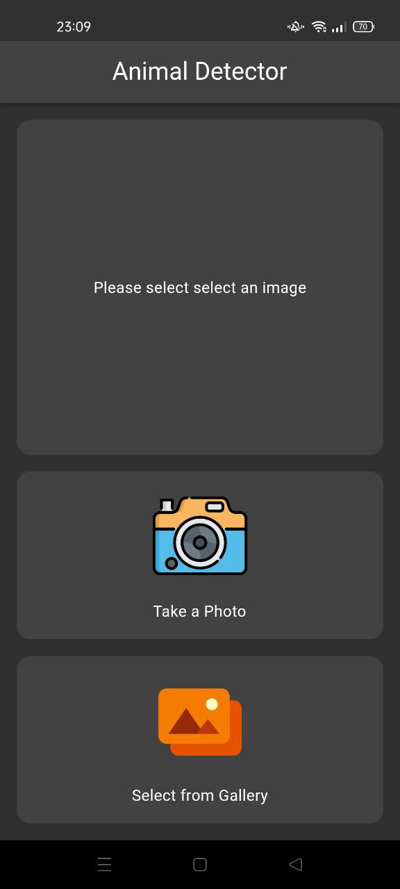
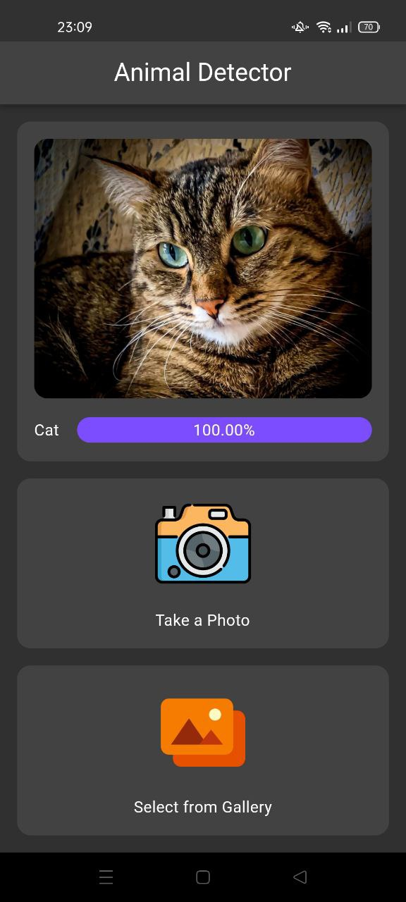
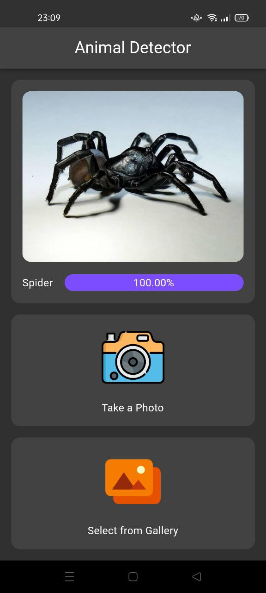

# Animal Detector
Animal detection with Flutter and TFLite. Animal Detector makes it possible to identify animals in 10 different categories, including cat, dog, spider, sheep butterfly, horse squirrel, cow, chicken and elephant.

## Data set
- [Kaggle](https://www.kaggle.com/datasets/alessiocorrado99/animals10)

## Preview
<p align='center'>
    
    
    
</p>

##### This project contains generated files. Don't forget to run scripts below before running the project.
```sh
sh scripts/build_runner.sh
sh scripts/flutter_gen.sh
```